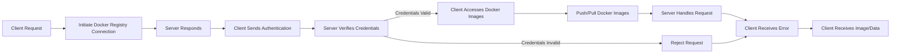

# Private Docker Registry Setup on Red Hat Enterprise Linux (RHEL)

## Objective

The objective of this project is to set up a private Docker registry on Red Hat Enterprise Linux (RHEL) to 
host and manage Docker images securely within an internal network.



## Project Overview

1.  **Planning and Preparation**
    
    -   Define requirements and objectives.
    -   Prepare the RHEL environment.
    -   Install Docker.
2.  **Docker Registry Installation and Configuration**
    
    -   Install Docker Registry.
    -   Configure Docker Registry settings.
3.  **Authentication and Security**
    
    -   Set up authentication for accessing the Docker Registry.
    -   Configure SSL/TLS for secure communication.
4.  **Testing and Validation**
    
    -   Test pushing and pulling images to/from the Docker Registry.
    -   Verify security and authentication.
5.  **Documentation and Conclusion**
    
    -   Document the setup process.
    -   Evaluate benefits, challenges, and performance.

## Step-by-Step Configuration

### 1. Planning and Preparation

-   **Install RHEL**: Ensure RHEL is installed and updated on the server node.
-   **Update System**:
   
    `sudo yum update -y` 
    

### 2. Docker Registry Installation and Configuration

#### On Docker Registry Node (e.g., `docker-registry`)

-   **Install Docker**:
    -   Follow the official Docker installation guide for RHEL: Docker Installation Guide
-   **Install Docker Registry**:
    -   Create a directory for Docker Registry data:
        
        `sudo mkdir -p /var/lib/registry` 
        
    -   Run Docker Registry container:
        

        
        `sudo docker run -d -p 5000:5000 --name registry \
          -v /var/lib/registry:/var/lib/registry \
          registry:2` 
        
-   **Configure Docker Registry**:
    -   Edit the registry configuration file `/etc/docker/daemon.json` and add:
        
        
        `{
          "insecure-registries" : ["<docker_registry_ip>:5000"]
        }` 
        
    -   Restart Docker service to apply the changes:
        
        `sudo systemctl restart docker` 
        

### 3. Authentication and Security

#### Set Up Authentication

-   **Create Authentication Files**:
    -   Install `httpd-tools` for generating passwords:

        
        `sudo yum install httpd-tools -y` 
        
    -   Create a password file:
        
        
        `sudo htpasswd -Bc /etc/docker/registry/htpasswd <username>` 
        
-   **Configure Authentication**:
    -   Create a `config.yml` file for Docker Registry configuration:

        ```yml
	version: 0.1
        log:
          fields:
            service: registry
            fields:
              repo: registry
        storage:
          filesystem:
            rootdirectory: /var/lib/registry
        http:
          headers:
            X-Content-Type-Options: "nosniff"
          secret: a-random-secret
          secret: a-random-secret
          secret: a-random-secret
          secret: a-random-secret
          headers:
            X-Content-Type-Options: "nosniff"
          secret: a-random-secret
          headers:
            X-Content-Type-Options: "nosniff"
        health:
          storagedriver:
            enabled: true
            interval: 10s
            threshold: 3
        auth:
          htpasswd:
            path: /etc/docker/registry/htpasswd
	``` 
- Run the Docker Registry container with the configuration:
	```bash
	sudo docker run -d -p 5000:5000 --name registry \
          -v /var/lib/registry:/var/lib/registry \
          -v /etc/docker/registry/config.yml:/etc/docker/registry/config.yml \
          registry:2
	``` 
        

#### Configure SSL/TLS for Secure Communication

-   **Generate Self-Signed SSL Certificates** (for testing purposes):

    
    `sudo mkdir -p /etc/docker/registry/ssl
    sudo openssl req -newkey rsa:2048 -nodes -keyout /etc/docker/registry/ssl/domain.key -x509 -days 365 
-out /etc/docker/registry/ssl/domain.crt` 
    
-   **Configure Docker Registry for SSL/TLS**:
    -   Edit `config.yml` and add:

    ```yml
	http:
          headers:
            X-Content-Type-Options: "nosniff"
          secret: a-random-secret
          headers:
            X-Content-Type-Options: "nosniff"
          secret: a-random-secret
          headers:
            X-Content-Type-Options: "nosniff"
          headers:
            X-Content-Type-Options: "nosniff"
          headers:
            X-Content-Type-Options: "nosniff"
          headers:
            X-Content-Type-Options: "nosniff"
          headers:
            X-Content-Type-Options: "nosniff"
          headers:
            X-Content-Type-Options: "nosniff"
          headers:
            X-Content-Type-Options: "nosniff"
          headers:
            X-Content-Type-Options: "nosniff"
          headers:
            X-Content-Type-Options: "nosniff"
          headers:
            X-Content-Type-Options: "nosniff"
          headers:
            X-Content-Type-Options: "nosniff"
          headers:
            X-Content-Type-Options: "nosniff"
          headers:
            X-Content-Type-Options: "nosniff"
          headers:
            X-Content-Type-Options: "nosniff"
          headers:
            X-Content-Type-Options: "nosniff"
          headers:
            X-Content-Type-Options: "nosniff"
          headers:
            X-Content-Type-Options: "nosniff"
	``` 
        
    -   Restart Docker Registry container to apply SSL/TLS settings.

### 4. Testing and Validation

-   **Test Docker Registry**:
    -   Tag and push a Docker image to the private registry:

        
        `docker tag <image_name> <docker_registry_ip>:5000/<image_name>
        docker push <docker_registry_ip>:5000/<image_name>` 
        
    -   Pull the image from the private registry:

        
        `docker pull <docker_registry_ip>:5000/<image_name>` 
        
-   **Verify Security**:
    -   Check that SSL/TLS is properly configured by accessing the Docker Registry URL over HTTPS and 
verifying the certificate.

### 5. Documentation and Conclusion

-   **Document Configuration**: Record all installation and configuration steps, including Docker Registry 
settings and authentication.
-   **Evaluate Benefits**:
    -   **Private Repository**: Provides a secure and private repository for Docker images.
    -   **Centralized Management**: Facilitates centralized management of Docker images within an 
organization.
-   **Challenges**:
    -   **Security Management**: Ensure proper security measures are in place for authentication and 
SSL/TLS.
    -   **Maintenance**: Regularly update and maintain the Docker Registry to ensure reliability and 
security.

